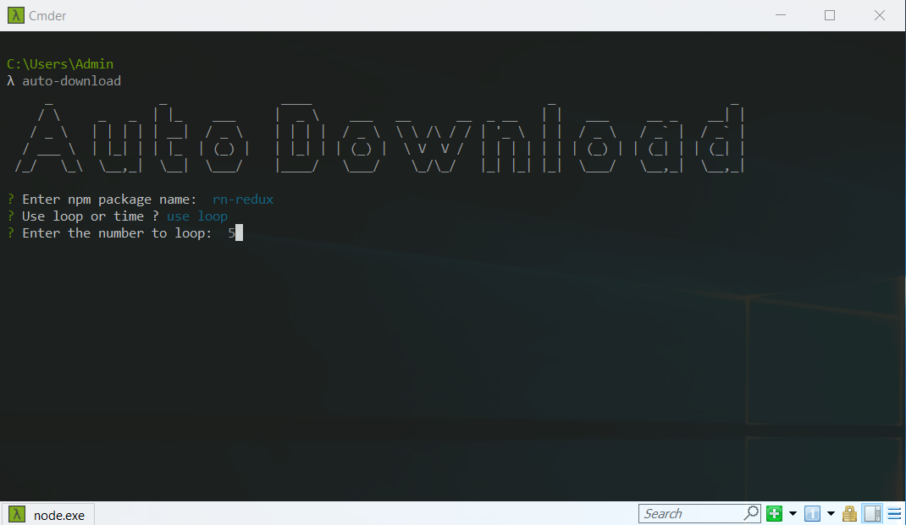

# Auto Download NPM Tool

Tool help us auto download package in npm

## Supported OperaSystem
* Window
* MacOSX
* Linux

## Make sure your computer has a nodejs installed
Install nodejs in your computer [click here](https://nodejs.org/en/)

## Install Auto Download

```bash
npm i -g auto-download
```

## Guide to auto-download

### How use ?
Open terminal, enter command line:

```bash
auto-download
```
* Enter package name
* Choose loop or time ?
* Enter number


